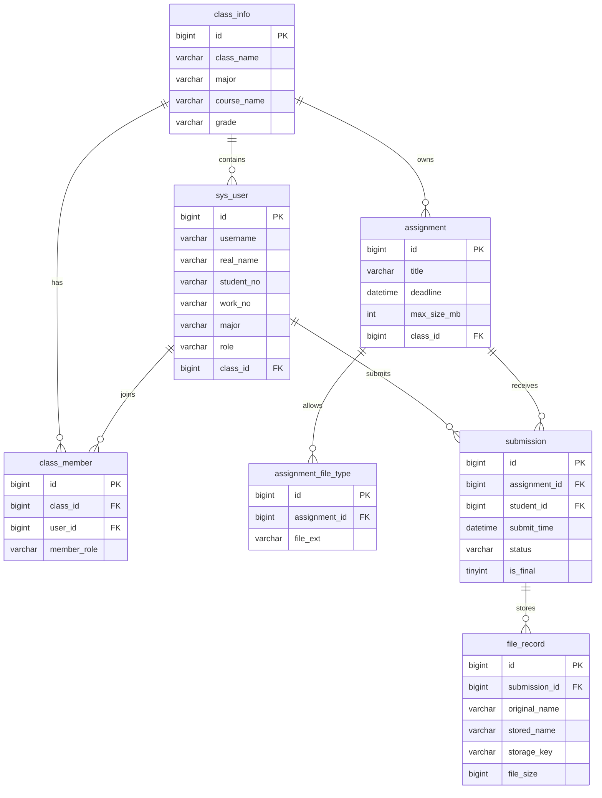

# 数据库 ER 图

```mermaid
erDiagram
  class_info ||--o{ sys_user : contains
  class_info ||--o{ class_member : has
  sys_user ||--o{ class_member : joins
  class_info ||--o{ assignment : owns
  assignment ||--o{ assignment_file_type : allows
  sys_user ||--o{ submission : submits
  assignment ||--o{ submission : receives
  submission ||--o{ file_record : stores

  class_info {
    bigint id PK
    varchar class_name
    varchar major
    varchar course_name
    varchar grade
  }

  sys_user {
    bigint id PK
    varchar username
    varchar real_name
    varchar student_no
    varchar work_no
    varchar major
    varchar role
    bigint class_id FK
  }

  class_member {
    bigint id PK
    bigint class_id FK
    bigint user_id FK
    varchar member_role
  }

  assignment {
    bigint id PK
    varchar title
    datetime deadline
    int max_size_mb
    bigint class_id FK
  }

  assignment_file_type {
    bigint id PK
    bigint assignment_id FK
    varchar file_ext
  }

  submission {
    bigint id PK
    bigint assignment_id FK
    bigint student_id FK
    datetime submit_time
    varchar status
    tinyint is_final
  }

  file_record {
    bigint id PK
    bigint submission_id FK
    varchar original_name
    varchar stored_name
    varchar storage_key
    bigint file_size
  }
```
